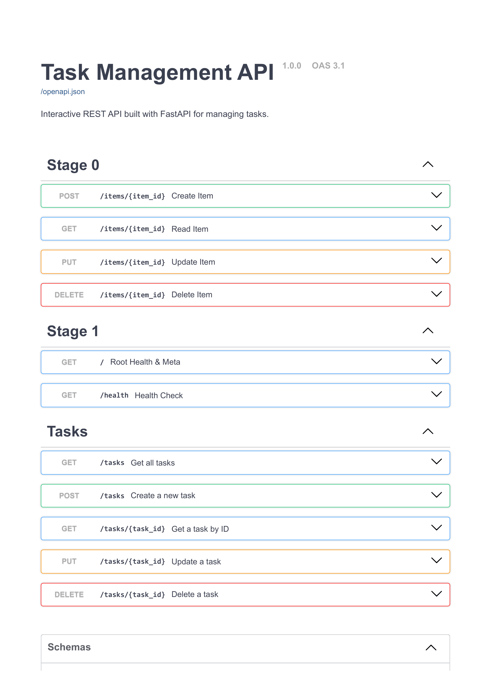

# Task API

A CRUD REST API for managing to-do tasks, built with FastAPI (Python).

## Run locally

### Clone the repository

```bash
git clone https://github.com/hidayahrr/AI-Engineering.git
cd "AI-Engineering\1-CRUD-API-Python"
```

### Start the application

```bash
docker compose up --build
```

The API will be available at:

- API: `http://localhost:8000`
- Swagger UI: `http://localhost:8000/docs`

To stop the application:

```bash
docker compose down
```

## Endpoints

| Method | Path | Description | Status codes |
|--------|------|-------------|--------------|
| GET | `/` | API info | 200 |
| GET | `/health` | Health check | 200 |
| GET | `/tasks` | List all tasks | 200 |
| GET | `/tasks/{id}` | Get one task | 200, 404 |
| POST | `/tasks` | Create a task | 201, 422 |
| PUT | `/tasks/{id}` | Update a task | 200, 400, 404 |
| DELETE | `/tasks/{id}` | Delete a task | 204, 404 |
| GET | `/stats` | Task statistics | 200 |
| POST | `/reset` | Reset to seed data | 200 |

## Testing with curl.exe on Windows

PowerShell corrupts JSON quoting when passed inline to `curl.exe`. The reliable pattern is to write the JSON body to a file first, then pass it with `-d "@file.json"`.

```powershell
# Send the request
curl.exe -i -X POST http://localhost:8000/tasks `
  -H "Content-Type: application/json" `
  -d "@create.json"
```

Example response:

```
HTTP/1.1 201 Created
date: Sat, 18 Jul 2026 17:50:46 GMT
server: uvicorn
content-length: 43
content-type: application/json

{"id":4,"title":"Final check","done":false}
```

## Data model

```json
{
  "id": 1,
  "title": "Buy groceries",
  "done": false
}
```

Tasks are stored in memory only. Restarting the container resets all tasks to the three seed tasks. This is intentional for this assignment.

## Swagger UI

