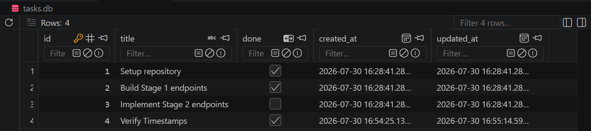

# Task Management API (SQLite & SQLModel)

A persistent CRUD REST API for managing to-do tasks, built with FastAPI, SQLModel, and SQLite in Python.

## Run locally

### Clone the repository

```bash
git clone https://github.com/hidayahrr/AI-Engineering.git
cd "AI-Engineering/2-CRUD-API-Python-Database"
```

### Start the application

```bash
docker compose up --build -d
```

The API will be available at:

- API: `http://localhost:8000`
- Swagger UI (Interactive Docs): `http://localhost:8000/docs`

To stop the application:

```bash
docker compose down
```

## Endpoints

| Method | Path | Description | Status codes |
|--------|------|-------------|--------------|
| GET | `/` | API metadata and endpoint listing | 200 |
| GET | `/health` | Application health check | 200 |
| GET | `/tasks` | List all tasks (supports query params: `search`, `done`, `sort`) | 200 |
| GET | `/tasks/{id}` | Get task by ID | 200, 404 |
| POST | `/tasks` | Create a new task | 201, 400 |
| PUT | `/tasks/{id}` | Update title or completion status | 200, 400, 404 |
| DELETE | `/tasks/{id}` | Delete a task | 204, 404 |
| GET | `/stats` | Task statistics aggregated via SQL `COUNT()` | 200 |

## Testing with PowerShell

In PowerShell, invoke API endpoints using `Invoke-RestMethod`:

```powershell
# Get all tasks
Invoke-RestMethod -Uri "http://localhost:8000/tasks" -Method Get

# Filter completed tasks using SQL WHERE clause
Invoke-RestMethod -Uri "http://localhost:8000/tasks?done=true" -Method Get

# Search tasks using SQL LIKE operator
Invoke-RestMethod -Uri "http://localhost:8000/tasks?search=repository" -Method Get

# Sort tasks alphabetically
Invoke-RestMethod -Uri "http://localhost:8000/tasks?sort=title" -Method Get

# Create a new task
Invoke-RestMethod `
  -Uri "http://localhost:8000/tasks" `
  -Method Post `
  -ContentType "application/json" `
  -Body '{"title":"Complete Stage 4"}'
```

Example response:

```json
{
  "id": 4,
  "title": "Complete Stage 4",
  "done": false,
  "created_at": "2026-07-30T16:54:25.138Z",
  "updated_at": "2026-07-30T16:54:25.138Z"
}
```

## Data model

```json
{
  "id": 1,
  "title": "Setup repository",
  "done": true,
  "created_at": "2026-07-30T16:28:41.280Z",
  "updated_at": "2026-07-30T16:28:41.280Z"
}
```

Tasks are persisted in a local SQLite database (`tasks.db`). Data survives application restarts. If the database file is missing on startup, the application automatically creates the database schema and seeds three initial tasks.

## Technologies

- FastAPI
- SQLModel
- SQLite
- Docker & Docker Compose
- Uvicorn
- Python 3.13

## Interactive API Documentation

Once the application is running, open:

- Swagger UI: `http://localhost:8000/docs`
- OpenAPI schema: `http://localhost:8000/openapi.json`

## Database

