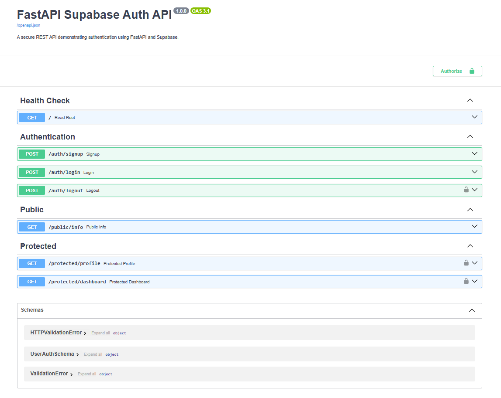

# FastAPI Supabase Authentication API

A production-ready RESTful authentication service built with **FastAPI**, **Supabase Auth**, and **Pydantic**. This API implements user registration, session login, JWT token verification via FastAPI dependencies, session termination (logout), and integrated OpenAPI/Swagger UI authorization controls.

---

## Features

- **User Authentication**: Secure user registration and password authentication via Supabase Auth.
- **Middleware Dependency**: Reusable `get_current_user` FastAPI dependency utilizing `HTTPBearer` for token extraction and cryptographic validation.
- **Session Management**: Revoke active user sessions using the global sign-out endpoint.
- **OpenAPI / Swagger Integration**: Interactive documentation at `/docs` with built-in Bearer token authorization modal.

---

## Tech Stack

- **Framework**: [FastAPI](https://fastapi.tiangolo.com/)
- **Authentication Provider**: [Supabase Auth](https://supabase.com/docs/guides/auth)
- **ASGI Server**: [Uvicorn](https://www.uvicorn.org/)
- **Data Validation**: [Pydantic](https://docs.pydantic.dev/)
- **Environment Management**: [python-dotenv](https://github.com/theskumar/python-dotenv)

---

## Project Structure

```text
4-FastAPI-Supabase-Auth/
├── assets/
│   └── swagger-ui.png         # Swagger UI documentation screenshot
├── .env                       # Local environment variables (git-ignored)
├── .gitignore                 # Git ignore rules
├── main.py                    # Application endpoints and auth dependency
├── requirements.txt           # Python dependencies
├── schemas.py                 # Pydantic models for request payloads
└── README.md                  # Project documentation
```

## Prerequisites

- **Python**: Version 3.9 or higher
- **Supabase Account**: An active Supabase project with Auth enabled

## Environment Setup

Create a `.env` file in the root directory of the project (`4-FastAPI-Supabase-Auth/.env`) and add your Supabase credentials:

```code
SUPABASE_URL=[https://your-supabase-project-id.supabase.co](https://your-supabase-project-id.supabase.co)
SUPABASE_KEY=your-supabase-anon-key
```

**Note:** Obtain your `SUPABASE_URL` and `SUPABASE_KEY` (anon key) from your Supabase Dashboard under Project Settings > API.

## Installation & Local Quickstart

Follow these steps to set up and run the API locally in under 5 minutes:

### 1. Clone the Repository

```bash
git clone [https://github.com/your-username/your-repository-name.git](https://github.com/your-username/your-repository-name.git)
cd "AI Engineering/4-FastAPI-Supabase-Auth"
```

### 2. Create and Activate a Virtual Environment

**Windows (PowerShell):**

```powershell
python -m venv venv
.\venv\Scripts\Activate.ps1
```

**macOS / Linux:**

```bash
python3 -m venv venv
source venv/bin/activate
```

### 3. Install Dependencies

```bash
pip install -r requirements.txt
```

### 4. Run the Application

Start the Uvicorn development server:

```bash
python -m uvicorn main:app --reload --port 8000
```

The API will be accessible at `http://localhost:8000`.

## API Reference

| Method | Endpoint | Description | Requires Auth? |
|--------|----------|-------------|----------------|
| GET | `/` | Health check endpoint | No |
| POST | `/auth/signup` | Register a new user with email & password | No |
| POST | `/auth/login` | Authenticate user credentials and return JWT tokens | No |
| POST | `/auth/logout` | Revoke active user session | Yes (Bearer Token) |
| GET | `/public/info` | Unprotected public information route | No |
| GET | `/protected/profile` | Retrieve verified user profile metadata | Yes (Bearer Token) |
| GET | `/protected/dashboard` | Secondary protected checkpoint endpoint | Yes (Bearer Token) |

## Interactive Documentation (Swagger UI)

FastAPI automatically generates interactive API documentation powered by OpenAPI.

1. Open your browser and navigate to `http://localhost:8000/docs`.
2. Authenticate using `POST /auth/login` to obtain an `access_token`.
3. Click the **Authorize** button at the top right of the page.
4. Enter the token into the **Value** field and click **Authorize**.
5. Test protected endpoints directly from the browser interface.

