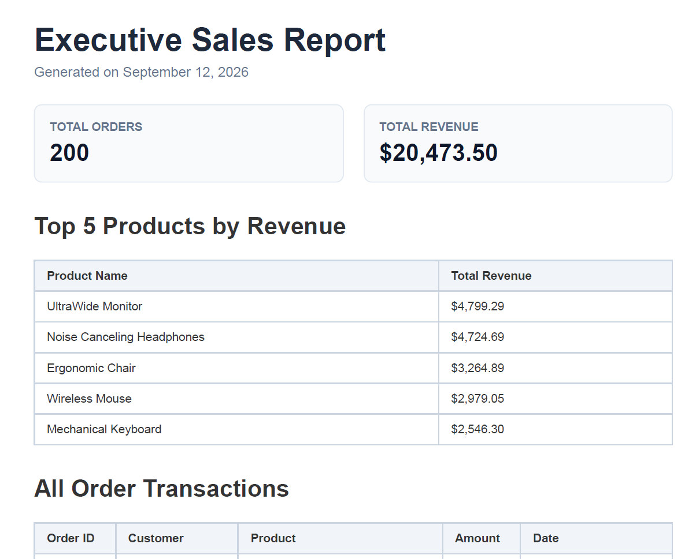

# PDF Report Generator Pipeline

A FastAPI and Playwright-backed reporting microservice that aggregates sales data from SQLite, renders it into a print-ready PDF using Chromium, and serves the generated document directly named **`downloaded-report.pdf`** via API links.

---

## Dataset & Project Overview

* **Dataset**: Option A – The Little Shop (E-commerce Orders)
* **Schema**: `orders` table containing `id`, `customer`, `product`, `amount`, `created_at`
* **Output File**: `downloaded-report.pdf`

---

## Stage 0: Environment Setup

Initialize the virtual environment, install dependencies, configure Chromium, and set up `.gitignore`.

### PowerShell Commands

```powershell
# Create and activate virtual environment
python -m venv .venv
.\.venv\Scripts\Activate.ps1

# Install dependencies
pip install fastapi uvicorn playwright pydantic

# Install headless Chromium browser engine
playwright install chromium
```

### `.gitignore` Configuration

```plaintext
.venv/
__pycache__/
report.db
reports/*.pdf
!reports/.gitkeep
*.pdf
```

---

## Stage 1: Data Generation (`seed.py`)

Generates 200 idempotent mock orders distributed across the past 30 days.

### Python

```python
import sqlite3
import random
from datetime import datetime, timedelta

def seed_db():
    conn = sqlite3.connect("report.db")
    cursor = conn.cursor()
    cursor.execute("DROP TABLE IF EXISTS orders")
    cursor.execute("""
        CREATE TABLE orders (
            id INTEGER PRIMARY KEY AUTOINCREMENT,
            customer TEXT NOT NULL,
            product TEXT NOT NULL,
            amount REAL NOT NULL,
            created_at TEXT NOT NULL
        )
    """)
    products = ["UltraWide Monitor", "Ergonomic Chair", "Mechanical Keyboard", "USB-C Dock", "Wireless Mouse"]
    customers = ["Alice Smith", "Bob Jones", "Charlie Brown", "Diana Prince", "Evan Wright"]
    
    orders = []
    now = datetime.now()
    for _ in range(200):
        cust = random.choice(customers)
        prod = random.choice(products)
        amt = round(random.uniform(20.0, 500.0), 2)
        days_ago = random.randint(0, 30)
        dt = (now - timedelta(days=days_ago)).strftime("%Y-%m-%d %H:%M:%S")
        orders.append((cust, prod, amt, dt))
        
    cursor.executemany("INSERT INTO orders (customer, product, amount, created_at) VALUES (?, ?, ?, ?)", orders)
    conn.commit()
    conn.close()

if __name__ == "__main__":
    seed_db()
```

### Execution

```powershell
python seed.py
```

---

## Stage 2: SQL Data Aggregation (`db.py`)

Extracts four key metrics from SQLite using aggregations (`COUNT`, `SUM`, `GROUP BY`).

### Python

```python
import sqlite3
from typing import Dict, Any

def get_report_data(db_path: str = "report.db") -> Dict[str, Any]:
    conn = sqlite3.connect(db_path)
    conn.row_factory = sqlite3.Row
    cursor = conn.cursor()

    # Query 1: Total Orders
    cursor.execute("SELECT COUNT(*) AS total_orders FROM orders")
    total_orders = cursor.fetchone()["total_orders"]

    # Query 2: Total Revenue
    cursor.execute("SELECT COALESCE(SUM(amount), 0) AS total_revenue FROM orders")
    total_revenue = round(cursor.fetchone()["total_revenue"], 2)

    # Query 3: Top 5 Products by Revenue
    cursor.execute("""
        SELECT product, ROUND(SUM(amount), 2) AS revenue
        FROM orders GROUP BY product ORDER BY revenue DESC LIMIT 5
    """)
    top_5_products = [dict(row) for row in cursor.fetchall()]

    # Query 4: Orders per day for last 7 days
    cursor.execute("""
        SELECT DATE(created_at) AS order_date, COUNT(*) AS order_count
        FROM orders WHERE created_at >= DATE('now', '-7 days')
        GROUP BY DATE(created_at) ORDER BY order_date ASC
    """)
    orders_last_7_days = [dict(row) for row in cursor.fetchall()]
    conn.close()

    return {
        "total_orders": total_orders,
        "total_revenue": total_revenue,
        "top_5_products": top_5_products,
        "orders_last_7_days": orders_last_7_days,
    }
```

---

## Stage 3: PDF Generation (`pdf_generator.py`)

Renders aggregated metrics and long transactional tables into PDF format using Playwright Chromium with explicit CSS page-break rules (`tr { break-inside: avoid; }`).

### Python

```python
import os
import sqlite3
from datetime import datetime
from playwright.sync_api import sync_playwright
from db import get_report_data

def get_all_orders(db_path: str = "report.db"):
    conn = sqlite3.connect(db_path)
    conn.row_factory = sqlite3.Row
    cursor = conn.cursor()
    cursor.execute("SELECT * FROM orders ORDER BY created_at DESC")
    orders = [dict(row) for row in cursor.fetchall()]
    conn.close()
    return orders

def generate_html_report(data: dict, all_orders: list) -> str:
    today_str = datetime.now().strftime("%B %d, %Y")
    top_rows = "".join(f"<tr><td>{p['product']}</td><td>${p['revenue']:,.2f}</td></tr>" for p in data["top_5_products"])
    all_rows = "".join(f"<tr><td>#{o['id']}</td><td>{o['customer']}</td><td>{o['product']}</td><td>${o['amount']:,.2f}</td><td>{o['created_at']}</td></tr>" for o in all_orders)

    return f"""
    <!DOCTYPE html>
    <html>
    <head>
        <style>
            body {{ font-family: Arial, sans-serif; margin: 20px; }}
            table {{ width: 100%; border-collapse: collapse; margin-bottom: 20px; }}
            th, td {{ border: 1px solid #cbd5e1; padding: 8px; font-size: 12px; }}
            th {{ background-color: #f1f5f9; }}
            tr {{ break-inside: avoid; }}
            thead {{ display: table-header-group; }}
        </style>
    </head>
    <body>
        <h1>Executive Sales Report</h1>
        <p>Generated on {today_str}</p>
        <h2>Metrics Summary</h2>
        <p>Total Orders: {data['total_orders']} | Total Revenue: ${data['total_revenue']:,.2f}</p>
        <h2>Top 5 Products</h2>
        <table><thead><tr><th>Product</th><th>Revenue</th></tr></thead><tbody>{top_rows}</tbody></table>
        <h2>All Orders</h2>
        <table><thead><tr><th>ID</th><th>Customer</th><th>Product</th><th>Amount</th><th>Date</th></tr></thead><tbody>{all_rows}</tbody></table>
    </body>
    </html>
    """

def render_pdf(output_path: str = "reports/downloaded-report.pdf") -> str:
    os.makedirs(os.path.dirname(output_path), exist_ok=True)
    report_data = get_report_data()
    all_orders = get_all_orders()
    html_content = generate_html_report(report_data, all_orders)

    with sync_playwright() as p:
        browser = p.chromium.launch(headless=True)
        page = browser.new_page()
        page.set_content(html_content)
        page.pdf(path=output_path, format="A4", print_background=True, margin={"top": "20mm", "bottom": "20mm", "left": "15mm", "right": "15mm"})
        browser.close()
    return output_path
```

---

## Stage 4 & Stage 5: API Endpoints & Idempotency (`main.py`)

Wraps rendering in FastAPI, tracking generated reports in SQLite and enforcing daily idempotency checks.

### Python

```python
import os
import sqlite3
import uuid
from datetime import datetime
from typing import Optional
from fastapi import FastAPI, HTTPException, Response, status
from fastapi.responses import FileResponse
from pydantic import BaseModel
from pdf_generator import render_pdf

# Initialize FastAPI application server
app = FastAPI(title="PDF Report Generator")


# Pydantic schema to parse optional JSON payload {"force": true}
class ReportRequest(BaseModel):
    force: Optional[bool] = False


def init_reports_db(db_path: str = "report.db"):
    """Creates the reports tracking table inside report.db if it does not exist."""
    conn = sqlite3.connect(db_path)
    cursor = conn.cursor()
    cursor.execute(
        """
        CREATE TABLE IF NOT EXISTS reports (
            id TEXT PRIMARY KEY,
            path TEXT NOT NULL,
            created_at TEXT NOT NULL
        )
    """
    )
    conn.commit()
    conn.close()


# Ensure database table is initialized when application starts
init_reports_db()


@app.get("/health")
def health_check():
    """Health check endpoint to verify server status."""
    return {"status": "ok"}


@app.post("/reports")
def generate_report(payload: Optional[ReportRequest] = None, response: Response = None):
    """
    Handles POST /reports with idempotency protection.
    1. Checks if a report was already generated today.
    2. If existing and force != True: returns existing metadata with 200 OK.
    3. If not found or force == True: renders new PDF to disk, saves metadata, returns 201 Created.
    """
    force_generate = payload.force if payload else False
    today_prefix = datetime.now().strftime("%Y-%m-%d")

    conn = sqlite3.connect("report.db")
    conn.row_factory = sqlite3.Row
    cursor = conn.cursor()

    # IDEMPOTENCY CHECK: Search database for existing report generated today
    if not force_generate:
        cursor.execute(
            "SELECT * FROM reports WHERE created_at LIKE ? ORDER BY created_at DESC LIMIT 1",
            (f"{today_prefix}%",),
        )
        existing_report = cursor.fetchone()

        # If report exists in database and physical PDF exists on disk, reuse it
        if existing_report and os.path.exists(existing_report["path"]):
            conn.close()
            response.status_code = status.HTTP_200_OK
            return {
                "id": existing_report["id"],
                "file": f"/reports/{existing_report['id']}/file",
                "created_at": existing_report["created_at"],
                "reused": True,
            }

    # GENERATE FRESH REPORT: If no report exists today or force=True
    report_id = str(uuid.uuid4())[:8]
    
    # Target absolute directory path to guarantee file creation inside reports/
    target_dir = os.path.join(os.getcwd(), "reports")
    os.makedirs(target_dir, exist_ok=True)
    pdf_filename = os.path.join(target_dir, "downloaded-report.pdf")

    # Render PDF via Playwright Chromium
    render_pdf(output_path=pdf_filename)

    created_at = datetime.now().strftime("%Y-%m-%d %H:%M:%S")

    # Save metadata record into database
    cursor.execute(
        "INSERT INTO reports (id, path, created_at) VALUES (?, ?, ?)",
        (report_id, pdf_filename, created_at),
    )
    conn.commit()
    conn.close()

    # Set response code to 201 Created for freshly rendered reports
    response.status_code = status.HTTP_201_CREATED
    return {
        "id": report_id,
        "file": f"/reports/{report_id}/file",
        "created_at": created_at,
        "reused": False,
    }


@app.get("/reports/{report_id}")
def get_report_metadata(report_id: str):
    """Retrieves metadata for a specific report ID."""
    conn = sqlite3.connect("report.db")
    conn.row_factory = sqlite3.Row
    cursor = conn.cursor()
    cursor.execute("SELECT * FROM reports WHERE id = ?", (report_id,))
    row = cursor.fetchone()
    conn.close()

    if not row:
        raise HTTPException(status_code=404, detail="Report not found")

    return {
        "id": row["id"],
        "file": f"/reports/{row['id']}/file",
        "created_at": row["created_at"],
    }


@app.get("/reports/{report_id}/file")
def download_report_file(report_id: str):
    """Serves the PDF file from disk."""
    conn = sqlite3.connect("report.db")
    conn.row_factory = sqlite3.Row
    cursor = conn.cursor()
    cursor.execute("SELECT * FROM reports WHERE id = ?", (report_id,))
    row = cursor.fetchone()
    conn.close()

    if not row:
        raise HTTPException(status_code=404, detail="Report not found")

    file_path = row["path"]

    if not os.path.exists(file_path):
        raise HTTPException(status_code=404, detail="PDF file missing from disk")

    return FileResponse(
        path=file_path,
        media_type="application/pdf",
        filename="downloaded-report.pdf",
    )
```

---

## API Testing & Verification

### Start Server

```powershell
uvicorn main:app --reload --port 8000
```

### Verification Commands

1. **Generate Report (Standard POST)**:

```powershell
curl.exe -i -X POST http://localhost:8000/reports
```

2. **Download PDF as** **`downloaded-report.pdf`**:

```powershell
curl.exe -i -o downloaded-report.pdf http://localhost:8000/reports/<REPORT_ID>/file
```

3. **Verify Idempotency (Duplicate POST returning 200 OK)**:

```powershell
curl.exe -i -X POST http://localhost:8000/reports
```

4. **Force Fresh Generation (POST with** **`{"force": true}`****)**:

```powershell
Invoke-RestMethod -Uri "http://localhost:8000/reports" -Method POST -ContentType "application/json" -Body '{"force": true}'
```

## Architecture Design Notes

### Stage 4 Bottleneck Reflection

PDF generation work should be moved out of the synchronous request-response cycle into a background job queue when report rendering time exceeds typical HTTP timeout thresholds (e.g., >2-3 seconds) or when multiple concurrent users generate large reports simultaneously, which would otherwise exhaust API worker threads and freeze the application.

### Stage 5 Idempotency Reflection

Our daily generation check protects against accidental double-clicks or repeated automated retries generating redundant PDF files and wasting CPU resources. In a real-world e-commerce system, a missing idempotency check on payment or invoice generation endpoints could result in charging a customer twice or sending duplicate transaction receipts.

---

## Report Preview

